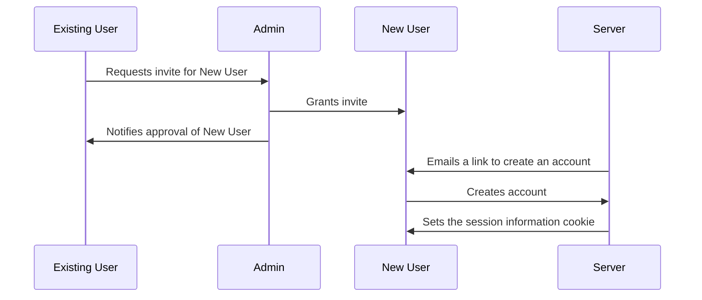
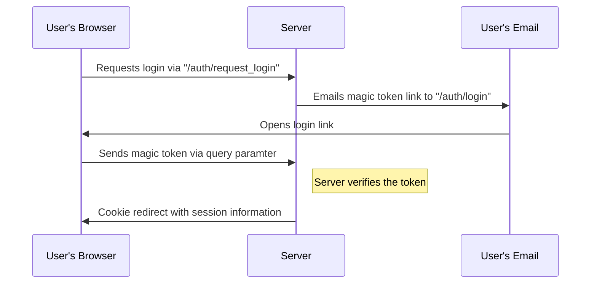
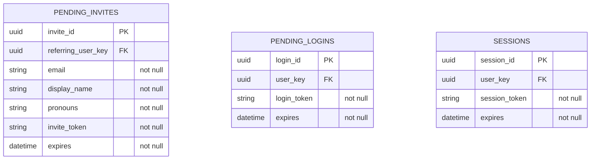

# Authentication

At a high level, the application will use a magic token email flow, similar to that used by Slack (e.g. the "Sign In with Email" button on the [Slack Sign In page](https://slack.com/signin%20#/signin)).

New users will be added to the application via a referral/vouching approach. This allows for a slightly higher level of vetting for people that will be potentially visiting each other's homes.

## Flows

### Invitation

### Login

## User Interface

Every request to the application that is not made via a logged in user should redirect to the `/login` page.

Invite requests should be available via the navigation menu bar as:

* `Request an Invite` -> `/request_invite`

Pending invites should be available to the admin user in the status bar as:

* `Pending Invite Approvals` -> `/pending_invites`

The login and create account pages should not be reachable via navigation from the signed-in user pages.

### The `/login` page

The page should have an empty menu bar with the application's name.

* In the center, there should be an input labeled `Email` where the user enters their login email
* Below that, there should be a `Login` button
  * No matter what, submitting should display a "Check your email for the login link"

### The `/request_invite` page

* There should be a section header named `Who are you inviting?`
* There should be an input labeled `Email` for the new user's email
* There should be an input labeled `Display Name`
* There should be an input labeled `Pronouns`
* There should be a submit button
  * Submitting should clear the form and display a success message with the requested user's display name

### The `/pending_invites` page

* There should be a section header named `Pending Invites`
* There should be a grid that displays the following columns
  * `Requested User` which shows `<display_name> (<pronouns>) <email>`
  * `Referring User` which shows `<display_name> (<pronouns>)`
  * `Actions` which has an `Approve Request` button
* Approving a request refreshes the page

### The `/create_account` page

* There should be a section named `Create Account`
* There should be an input labeled `Display Name` which is auto-populated
* There should be an input labeled `Pronouns` which is auto-populated
* There should be an input labeled `Dietary Needs` which is empty
* There should be a `Submit` button
  * Submitting the form should redirect to `/` (the request should set the session cookie)

## API

Endpoint                   | Query Params    | Methods | Purpose
---------------------------|-----------------|---------|-----------------------------------------------------------------------------------------------------------------------------------------------------------------------------------------
`/auth/request_login`      |                 | `POST`  | Start the login flow by sending an email to the provided email address if it exists in the database
`/auth/login`              | `token`, `page` | `GET`   | Given `token`, validate the token and redirect the user to `page` (or `/` if empty), setting the `session` cookie to an encrypted, secure cookie and storing the session in the database
`/auth/logout`             |                 | `GET`   | Given a valid existing session, remove the session from the database, unset the session cookie, and redirect the user to `/login`
`/api/request_invite`      |                 | `POST`  | Create an invite request for an admin user to approve
`/api/pending_invites`     |                 | `GET`   | Get a list of pending invites
`/api/approve_invite/<id>` |                 | `POST`  | Approve an invite request (restricted to admin users)
`/api/create_account`      | `token`         | `POST`  | Move the existing invite to the `users` table, fill in overridden data, and set the `session` cookie

## Database Models

The `users` table is defined in [`USER_MANAGEMENT.md`](./USER_MANAGEMENT.md).

## Future Work

- [ ] Reject invite requests
- [ ] Admin notifications
  - [ ] Emails on invite request
  - [ ] Pending invite counter
- [ ] Moderation (suspend / ban a user)
