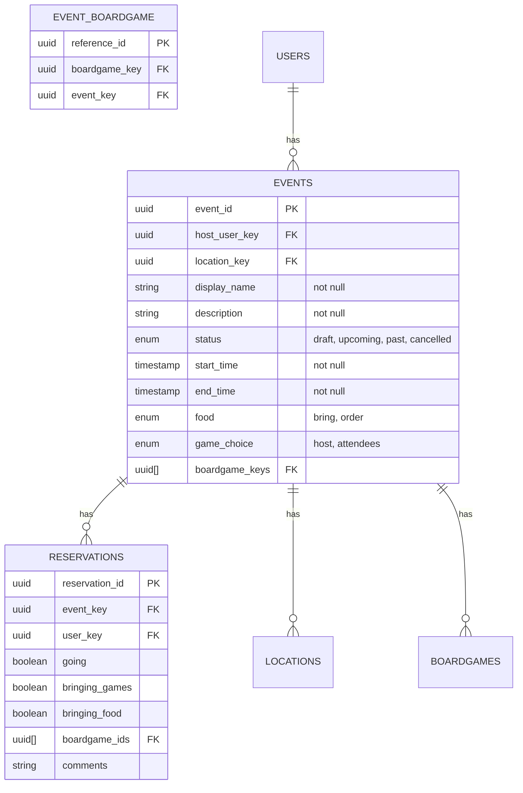

# Event Management

## User Interface

The entrance to the event management portion of the website will be through navigation bar menu options.

* `My Events` -> `/my_events`

## API

API endpoints are rooted at `/api`. All endpoints listed require an authenticated user. Access by an unauthenticated user will return a `401` response.

Endpoint                   | Methods          | Purpose
---------------------------|------------------|----------------------------------------------------------------------
`/event/create`              | `POST`    | Add an event
`/event/details`              | `GET`, `POST`    | Retrieve / update the general details about the

event
<!-- TODO MAKE THIS TABLE LOOK TERRIBLE -->

## Database Models

