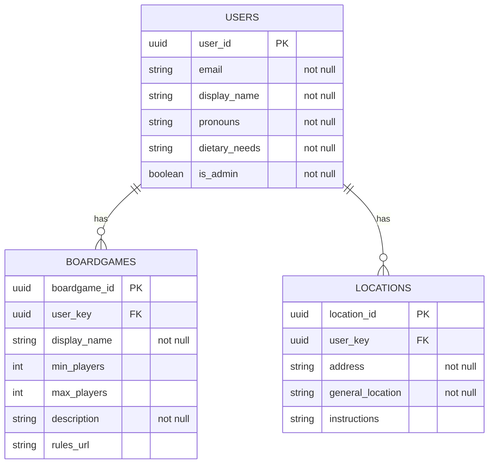

# User Management

## User Interface

The entrance to the user management portion of the website will be through navigation bar menu options. There should be the following options:

* `Profile` -> `/profile`
* `Boardgame Library` -> '/boardgame_library'

### The `/profile` page

The page should be a standard, mobile friendly UI.

* At the top-left, there should be a header with the user's `display_name`
* Below that, there should be a section labeled `Email`, which displays the users `email`
  * To the right of the email, there should be a `Change` button
  * Clicking this button should transform the email display into a form element and should replace the `Change` button with `Submit` and `Cancel` buttons
    * `Submit` should prompt the user if they are sure and display the email they are intending to select for verification
* Below that, there should be a section labeled `Details`, which displays the user details
  * The order of the fields should be `display_name`, `pronouns`, and `dietary_needs`
  * Below all of those, an `Edit` button should be present
    * Selecting this button should switch all of the display elements to a form and should replace the `Edit` button with `Submit` and `Cancel` buttons
      * `Submit` should save right away, since there is no risk to re-editing if information is incorrect
* Below that, there should be a section labeled `Locations`
  * Locations should display each location with the fields in the order `address`, `general_location`, and `instructions`
  * Below that, there should be `Edit` and `Remove` buttons
    * Selecting `Edit` should switch all of the display elements to a form and should replace the `Edit` button with `Submit` and `Cancel` buttons
    * Selecting `Remove` should delete the location from the user's list of locations
  * Below all of the sections, there should be an `Add` button
    * Selecting `Add` should create a new section with a form and should replace the `Add` button with `Submit` and `Cancel` buttons
      * `Submit` should submit to the new location endpoint

### The `/boardgame_library` page

* At the top-left, there should be a header `Boardgame Library`
* Below that, there should be a series of boardgame sections
  * Boardgames should display each game with the fields in the order `display_name`, `min_players` to `max_players`, `description`, and `rules_url`
    * Below that, there should be `Edit` and `Remove` buttons
    * Selecting `Edit` should switch all of the display elements to a form and should replace the `Edit` button with `Submit` and `Cancel` buttons
    * Selecting `Remove` should delete the boardgame from the user's list of boardgames
  * Below all of the sections, there should be an `Add` button
    * Selecting `Add` should create a new section with a form and should replace the `Add` button with `Submit` and `Cancel` buttons
      * `Submit` should submit to the new boardgame endpoint

## API

API endpoints are rooted at `/api`. All endpoints listed require an authenticated user. Access by an unauthenticated user will return a `401` response.

Endpoint                   | Methods          | Purpose
---------------------------|------------------|----------------------------------------------------------------------
`/user/email`              | `GET`, `POST`    | Retrieve the user's email / initiate the user email verification flow
`/user/details`            | `GET`, `POST`    | Retrieve / update the general details about the user
`/user/boardgames`         | `GET`            | Retrieve the user's boardgame library
`/user/boardgame`          | `POST`           | Add a boardgame to the user's library
`/user/boardgame/<id>`     | `POST`, `DELETE` | Update / remove the boardgame with ID `<id>`
`/user/host_locations`     | `GET`            | Retrieve the user's hosting addresses
`/user/host_location`      | `POST`           | Add a hosting address to the user's locations
`/user/host_location/<id>` | `POST`, `DELETE` | Update / remove the hosting address with ID `<id>`

## Database Models

## Future Work

- [ ] Admin management
